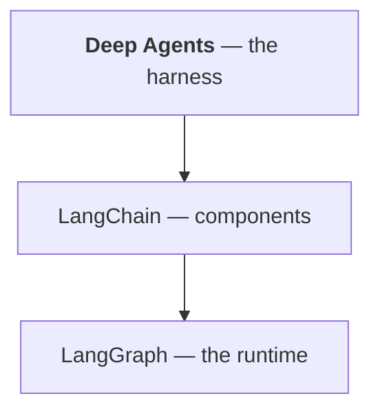

# Deep Agents: From First Harness to Production

A working book on Deep Agents — what the harness actually gives you, when its overhead pays
for itself, how to debug an agent that runs for minutes and writes files, and when not to use
it at all.

Written against **deepagents 0.7.11** / **langchain 1.3.18** / **langgraph 1.2.11**, on
Python 3.12.

**[Read it as a PDF](deepagents-book.pdf)** — the whole book in one file, 135 pages, with a linked table of contents. Rebuild it with `python scripts/build_pdf.py` (needs `weasyprint markdown pygments`, which are deliberately not project dependencies).

## Who this is for

Someone who has built an agent and watched it degrade on a long task — context filling up,
the plan forgotten, subtasks polluting the conversation. **You do not need to have used
LangChain or LangGraph**, though Chapter 5 explains why you are running both whether you meant
to or not.

If you already ship deep agents, Parts IV and V are the ones worth your time, and
[Chapter 6](chapters/06-planning.md) probably contains a surprise.

## Before you begin

You need Python 3.11+ and [`uv`](https://docs.astral.sh/uv/). **You do not need an API key.**

```bash
uv run python scripts/verify.py
```

```
[PASS] Python >= 3.11  found 3.12.12
[PASS] deepagents >= 0.7  found 0.7.11
[PASS] langchain >= 1.3  found 1.3.18
[PASS] langgraph >= 1.2  found 1.2.11
[PASS] build a deep agent  got CompiledStateGraph
[PASS] built-in tools present
[PASS] planning available when asked
[PASS] the scout example runs  findings written=True, todos=3

All 8 checks passed. You are ready for Chapter 1.
```

Then watch the whole investigation, and the test suite:

```bash
uv run python -m examples.scout
```

```bash
uv run --extra dev pytest -q
```

## The approach

**Every output printed in this book was produced by running the code.** Where a result
contradicted the documentation — which happened more here than in the other four books — the
chapter says so and shows the output:

- **`write_todos` is not enabled by default.** Planning is described everywhere as built in;
  in 0.7.11 you must add `TodoListMiddleware` yourself. The agent works, never plans, and
  loses the thread on long tasks. (Ch 6)
- **`FilesystemBackend(virtual_mode=True)` still writes to your real disk.** It constrains
  paths, not access — the library's own docstring says it "does not provide sandboxing". (Ch 8)
- **Backend factories were removed in 0.7.** `backend=lambda rt: StoreBackend(rt)` — the form
  in most published examples, including the official skill — now raises. (Ch 8)
- **`StoreBackend(namespace=...)` takes a callable, not a tuple**, and fails deep inside the
  write. (Ch 8)
- **`skills=[...]` without a backend silently does nothing.** (Ch 10)
- **The harness costs ~2,414 tokens of tool definitions on every call** — ~14,500 for a
  six-turn run, before any content. (Ch 1, 27)

Chapters end with **Try it** (runnable, offline, free) and **Takeaways**.

## The running example

`scout` — an incident investigator. Given a small tree of logs, config and runbooks, it plans,
greps, reads a runbook, checks a metric, and writes a cited findings report to
`/findings.md`.

**Its model is fake, deliberately.** `ScriptedModel` replays fixed replies with real tool
calls, so the harness drives it exactly as it would drive Claude — and every output here is
reproducible, offline, and costs nothing.

Code in [`examples/scout/`](examples/scout/).

---

## Contents

### Part I — Foundations

| # | Chapter | What it covers |
|---|---------|----------------|
| 1 | [Why Deep Agents](chapters/01-why-deep-agents.md) | The four ways a plain agent degrades — and what the harness costs |
| 2 | [Your first deep agent](chapters/02-first-agent.md) | Eight tools you did not ask for |
| 3 | [The built-in tools](chapters/03-built-in-tools.md) | What each returns, and why errors are not raised |
| 4 | [State: files and messages](chapters/04-state.md) | What it said versus what it did |
| 5 | [It is a LangGraph graph](chapters/05-it-is-a-graph.md) | The proof, and which library owns your error |

### Part II — The capabilities

| # | Chapter | What it covers |
|---|---------|----------------|
| 6 | [Planning](chapters/06-planning.md) | The default that isn't |
| 7 | [The virtual filesystem](chapters/07-virtual-filesystem.md) | Seeding, the read-write cycle, and telling it where to write |
| 8 | [Backends](chapters/08-backends.md) | Where files really live — and what `virtual_mode` does not mean |
| 9 | [Subagents](chapters/09-subagents.md) | Context isolation, measured |
| 10 | [Skills](chapters/10-skills.md) | Progressive disclosure, and why a skill never loads |
| 11 | [Memory across sessions](chapters/11-memory.md) | A filesystem with a longer lifetime |

### Part III — Control

| # | Chapter | What it covers |
|---|---------|----------------|
| 12 | [Prompting a deep agent](chapters/12-prompting.md) | Five lines that earn their place |
| 13 | [Permissions and approval](chapters/13-permissions.md) | Gating the irreversible |
| 14 | [Middleware and custom tools](chapters/14-middleware-and-tools.md) | Extending it, and what you cannot change |
| 15 | [Structured output](chapters/15-structured-output.md) | A typed summary and a file |
| 16 | [Context management](chapters/16-context-management.md) | What survives summarisation |
| 17 | [Choosing models](chapters/17-choosing-models.md) | A small model for the grinding |

### Part IV — Debugging

| # | Chapter | What it covers |
|---|---------|----------------|
| 18 | [The debugging mindset](chapters/18-debugging-mindset.md) | Four layers, and reading tool results not conclusions |
| 19 | [When it won't run](chapters/19-wont-run.md) | Every error, and the four that are silent |
| 20 | [When the agent does the wrong thing](chapters/20-wrong-thing.md) | The test that halves the problem |
| 21 | [Runaway agents and cost](chapters/21-runaway-and-cost.md) | 10007, and three layers of defence |
| 22 | [Observing a long run](chapters/22-observing.md) | Three signals, not one |
| 23 | [Cookbook](chapters/23-cookbook.md) | Symptom → cause → fix |

### Part V — Production

| # | Chapter | What it covers |
|---|---------|----------------|
| 24 | [Structuring a real project](chapters/24-project-structure.md) | Testing that capabilities are even enabled |
| 25 | [Testing](chapters/25-testing.md) | Four layers, 19 tests, 3s, no API key |
| 26 | [Evaluating a deep agent](chapters/26-evaluation.md) | Process metrics are free and nobody uses them |
| 27 | [Cost and context](chapters/27-cost.md) | Linear overhead against quadratic transcript |
| 28 | [Security](chapters/28-security.md) | Injection that persists across sessions |
| 29 | [Deployment](chapters/29-deployment.md) | It is a job, not a request |

### Part VI — Beyond

| # | Chapter | What it covers |
|---|---------|----------------|
| 30 | [Patterns](chapters/30-patterns.md) | Six shapes, ordered by cost |
| 31 | [Deep Agents, LangChain and LangGraph](chapters/31-the-stack.md) | Which layer you should be writing |
| 32 | [Anti-patterns](chapters/32-anti-patterns.md) | The catalogue, with a review checklist |

### Appendices

- [A — API cheatsheet](appendices/a-cheatsheet.md) — everything on one page
- [B — Glossary](appendices/b-glossary.md)
- [C — Further reading](appendices/c-further-reading.md)

---

## Suggested paths

**New to Deep Agents** — Chapters 1–5, then 6–11. Chapter 5 is the one that stops later errors
being mysterious.

**Already shipping** — Chapter 6 (the default that isn't), Chapter 8 (`virtual_mode`), then
Part IV. Chapter 23 is a reference; bookmark it.

**Deciding whether to adopt** — Chapters 1, 27 and 31.

## Where this fits

Five books, in two groups. Docker → Kubernetes is infrastructure. LangChain → LangGraph →
Deep Agents is the LLM stack, and it is a **stack, not a sequence**:



| | Book | What it is |
|---|---|---|
| | [Docker: From First Container to Production](https://github.com/johandeclercqdemocon/docker-docs) | the unit of deployment |
| | [Kubernetes: From First Pod to Production](https://github.com/johandeclercqdemocon/kubernetes-docs) | running many of those units |
| | [LangChain: From First Call to Production](https://github.com/johandeclercqdemocon/langchain-docs) | the components of an LLM application |
| | [LangGraph: From First Graph to Production](https://github.com/johandeclercqdemocon/langgraph-docs) | the runtime beneath them |
| **→** | [Deep Agents: From First Harness to Production](https://github.com/johandeclercqdemocon/deepagents-docs) | a ready-made harness on top |

**Deep Agents and LangGraph are alternatives, not a sequence** — a ready-made harness versus
control flow you design. [Chapter 31](chapters/31-the-stack.md) covers choosing.

**[The full reading order](https://github.com/johandeclercqdemocon/langchain-docs/blob/main/BOOKS.md)**
— paths by goal, with chapter numbers, across all five books.

### You are here

The top of the LLM stack. If you have not built an agent before, read **LangChain** first —
this book assumes you know what a tool and a model call are.

Chapter 1's argument that most agents should *not* be deep agents is sincere. The harness
costs ~2,400 tokens on every call; adopt it when the task is long and context is the problem.

## Conventions

Commands you can run:

```bash
uv run python scripts/verify.py
```

Real output, shown when it is the point:

```
default              [..., 'grep', 'task']
+ TodoListMiddleware [..., 'grep', 'task', 'write_todos']
```

Blockquotes mark rules worth remembering:

> **`virtual_mode=True` is not a sandbox.**

Anything that costs money says so first. Almost nothing does.

## Checking the book itself

```bash
uv run python scripts/check_snippets.py
```

Runs every runnable block, checks every internal link, parses every shell block, and validates
chapter cross-references. The same script ships in all five books.

## Versions

| Package | Version |
|---|---|
| deepagents | 0.7.11 |
| langchain | 1.3.18 |
| langchain-core | 1.6.1 |
| langgraph | 1.2.11 |
| Python | 3.12 |

This is a **pre-1.0 library moving faster than the two beneath it**.
[Appendix C](appendices/c-further-reading.md) covers telling current advice from stale.

## Licence

MIT. See [LICENSE](LICENSE).
