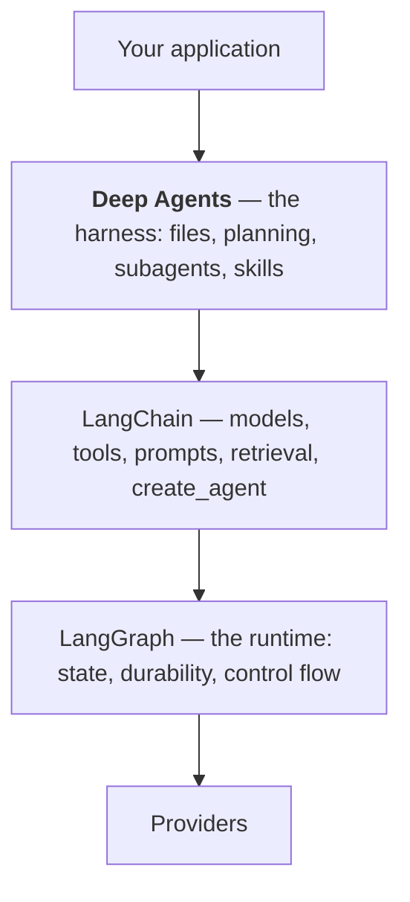

# Chapter 1 — Why Deep Agents

You can build an agent with `create_agent(model, tools=[...])`. Most agents should be exactly
that, and this chapter is partly a defence of stopping there.

What follows is the case for the layer above — and a map of where it sits, because Deep
Agents is the fourth name in a stack of four and confusing them costs real time.

## The agent that works until it doesn't

A LangChain agent is a model, a set of tools, and a loop. For a question answered in three
tool calls it is exactly right.

It degrades in a specific, recognisable way as the task gets longer.

**The context fills up.** Every tool result stays in the message list. Read four log files and
you are re-sending all four on every subsequent turn — quadratic cost, and eventually a
context-window error. The agent's memory and its working area are the same thing, and that is
the root problem.

**It loses the plot.** Twenty turns in, the model has forgotten the third of five things you
asked for. Nothing tracks what is done and what remains, because the only record is a
transcript it is increasingly summarising away.

**Everything shares one context.** A subtask that needs to read a large file pollutes the main
conversation with its contents forever, even though only the conclusion mattered.

**Nothing survives.** Close the session and the work is gone.

Each is fixable by hand. All four together are a harness, and writing one is a month you did
not plan for.

## What the harness adds

Deep Agents is that harness. `create_deep_agent()` gives you an agent that already has:

**A filesystem.** `ls`, `read_file`, `write_file`, `edit_file`, `glob`, `grep`, `delete` —
injected without being asked for. This is the fix for the context problem, and it is the most
important idea in the book: **the agent's working area stops being its message list.** It
reads a file when it needs it, writes conclusions out, and the transcript stays small.

**Subagents.** A `task` tool that spawns a fresh agent with its own clean context. The
subtask reads what it needs, and only its *answer* comes back. Context isolation as a
primitive.

**Planning.** A todo list the agent maintains as it works, so "what remains" is state rather
than something to infer from a transcript. Note: **not on by default** — Chapter 6.

**Skills.** Instructions loaded on demand rather than crammed into every prompt.

**Memory.** Files that persist across sessions.

You configure these. You do not implement them.

## Where it sits

Four layers, same maintainers, and this is the part worth getting straight:



Deep Agents is **built on** LangChain, which is built on LangGraph. So:

> **`create_deep_agent()` returns a LangGraph `CompiledStateGraph`** — the same object
> `create_agent()` returns, with more middleware attached.

Chapter 5 proves it. Everything that follows is real rather than analogy: the `checkpointer`
argument is LangGraph's, `thread_id` is a LangGraph thread, `interrupt_on` is LangGraph's
`interrupt()`, and the built-in tools are LangChain tools. When something breaks, you are
debugging one of three layers, and knowing which is most of the work.

### Which layer you should be writing

| What you need | Use |
|---|---|
| A model call, a prompt chain, RAG | **LangChain** |
| An agent with a fixed set of tools, finishing in a few turns | **LangChain** `create_agent` |
| Long multi-step work, large context, delegation, files | **Deep Agents** |
| Control flow *you* define — branches, loops, fan-out | **LangGraph** |
| Deterministic steps, no model | none of them — a task queue |

Note that Deep Agents and LangGraph are not ordered relative to each other. Deep Agents is a
*ready-made* harness; LangGraph is for when you want to design the control flow yourself. If
the harness fits, it saves a month. If your workflow is a specific graph, the harness is in
the way — and Chapter 31 covers telling those apart.

## When not to use it

Being honest, because the harness is not free:

**Your task finishes in a few turns.** The filesystem, planning and delegation machinery is
overhead. Use `create_agent`.

**You need precise control over the loop.** The harness is opinionated: filesystem and
subagent middleware are always present and their tool names are fixed. If you are fighting
that, write a graph.

**Your agent has one job.** A classifier does not need a virtual filesystem.

**You cannot afford the tokens.** Those eight built-in tools are defined on every call.
Measured:

```
ls             345 chars      read_file     1685 chars
write_file     622 chars      edit_file     1012 chars
delete         512 chars      glob          1526 chars
grep          2254 chars      task          1700 chars
TOTAL         9656 chars  (~2414 tokens, on every call)
```

**About 2,400 input tokens before your agent has done anything**, against zero for a plain
`create_agent` with no tools. On a short task that is the dominant cost. Chapter 27 works
through when it pays for itself — and it does pay, because the alternative is those log files
in the transcript instead.

The honest rule: **reach for Deep Agents when the task is long and the context is the problem.**
That is the specific ailment it cures.

## What it costs

**Tokens, on every call.** ~2,400 of them, measured above.

**Less predictability.** An agent that plans, delegates and writes files has more ways to go
wrong than one that calls two tools. Part IV exists for this.

**An opinionated shape.** You get the harness's idea of planning and files, not yours.

**A young, fast-moving library.** Faster-moving than LangChain, and much of what is written
about it is already wrong — including, as Chapter 6 measures, the claim that planning is
enabled by default.

## The example this book builds

One application, `scout`: an incident investigator. Given a small tree of logs, config and
runbooks, it plans an investigation, reads what it needs, checks a metric, and writes a cited
findings report to `/findings.md`.

It is small enough to hold in your head and exercises every capability: todos, the virtual
filesystem, a custom tool, subagents and skills.

**Its model is fake, deliberately.** `ScriptedModel` replays fixed replies with real tool
calls, so the harness drives it exactly as it would drive Claude — and every output printed in
this book is reproducible, offline, and costs nothing.

## Try it

You need Python 3.11+ and [`uv`](https://docs.astral.sh/uv/). No API key.

```bash
uv run python scripts/verify.py
```

```
[PASS] Python >= 3.11  found 3.12.12
[PASS] deepagents >= 0.7  found 0.7.11
[PASS] langchain >= 1.3  found 1.3.18
[PASS] langgraph >= 1.2  found 1.2.11
[PASS] build a deep agent  got CompiledStateGraph
[PASS] built-in tools present
[PASS] planning available when asked
[PASS] the scout example runs  findings written=True, todos=3

All 8 checks passed. You are ready for Chapter 1.
```

Note the fifth line: **`CompiledStateGraph`**. That is the LangGraph object, and Chapter 5
follows it up.

Then watch the whole investigation:

```bash
uv run python -m examples.scout
```

You are not expected to follow it yet. Chapter 2 builds the smallest possible deep agent.

## Takeaways

- A plain `create_agent` loop is the right default. It degrades in four recognisable ways:
  **context fills up, the plan is lost, subtasks pollute the main context, nothing survives.**
- The harness's central idea is that **the agent's working area stops being its message
  list** — it reads and writes files instead.
- You get filesystem tools, subagents, planning, skills and memory by configuration, not
  implementation.
- **Deep Agents is built on LangChain, which is built on LangGraph.**
  `create_deep_agent()` returns a LangGraph `CompiledStateGraph`.
- Deep Agents and LangGraph are alternatives, not a sequence: a **ready-made harness** versus
  **control flow you design**.
- Reach for it when **the task is long and context is the problem**. Not for short tasks,
  single-job agents, or when you need precise control of the loop.
- It costs **~2,400 input tokens per call** in tool definitions, plus predictability and an
  opinionated shape — and the library moves fast enough that much written about it is already
  wrong, including the claim that planning is on by default.

---

Next: [Chapter 2 — Your first deep agent](02-first-agent.md)
