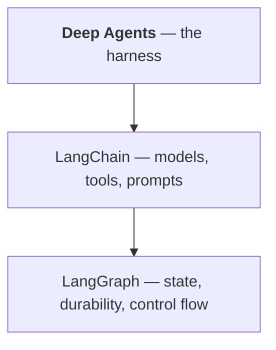

# Chapter 5 — It is a LangGraph graph

Chapter 1 claimed Deep Agents is a harness on LangChain, which runs on LangGraph. This chapter
proves it, because once you have seen it, a great deal stops being mysterious — including
several error messages that otherwise seem to come from nowhere.

## The proof

```python
agent = create_deep_agent(model=model, checkpointer=InMemorySaver())
type(agent).__name__          # 'CompiledStateGraph'
list(agent.get_graph().nodes)
```

```
type : CompiledStateGraph
nodes: ['__start__', 'model', 'tools', 'PatchToolCallsMiddleware.before_agent', '__end__']
```

A compiled LangGraph graph. Compare it with a plain LangChain agent built alongside:

```
create_agent      nodes: ['__start__', 'model', '__end__']
create_deep_agent nodes: ['__start__', 'model', 'tools', 'PatchToolCallsMiddleware.before_agent', '__end__']
```

**The same object, with more middleware.** `create_deep_agent` is `create_agent` with the
harness's middleware pre-attached — filesystem, subagents, and the rest.

Every LangGraph method is there:

```
get_state  get_state_history  update_state  stream  astream  get_graph  batch
```

And the state is a real LangGraph snapshot:

```
snapshot fields: ('values', 'next', 'config', 'metadata', 'created_at',
                  'parent_config', 'tasks', 'interrupts')
checkpoints: 4
```

Four checkpoints from one exchange, produced by code that never mentions LangGraph.

## What that explains

Things that would otherwise look arbitrary:

| You met it as | It really is |
|---|---|
| `checkpointer=` (Chapter 4) | LangGraph persistence |
| `thread_id` in your config | a LangGraph thread |
| files not surviving a second `invoke` | no checkpointer, so no state carried |
| `interrupt_on=` (Chapter 13) | LangGraph's `interrupt()` |
| `Command(resume=...)` | LangGraph's resume |
| `GraphRecursionError` | LangGraph's superstep cap — default **10007** |
| `InvalidUpdateError: Expected dict` | a LangGraph error from passing a string |
| `state_schema=` (Chapter 14) | a LangGraph state schema |
| `metadata["langgraph_node"]` when streaming | which graph node produced a token |

None of these are documented in Deep Agents, because they are not Deep Agents' — they belong
two layers down. **When you cannot find something in the Deep Agents documentation, look in
LangGraph's.** That single habit saves more time than anything else in this book.

## Three layers, three places a bug can live



**Deep Agents layer** — the filesystem tools, subagents, skills, planning. Symptoms: the agent
writes to the wrong path, a subagent returns something useless, a skill does not load.

**LangChain layer** — the model, your tools, prompts. Symptoms: a tool is ignored or called
with bad arguments, the model misreads a result. Chapter 3's warning about
`parse_docstring=True` is a LangChain issue surfacing here.

**LangGraph layer** — state, persistence, interrupts, the loop cap. Symptoms: files do not
persist, a resume fails, `GraphRecursionError`.

Part IV's triage is built on this split, and identifying the layer first is most of the work.

## Everything LangGraph can do, you can do

Because it is a real graph, its tooling applies:

```python
agent.get_state(config).values["files"]         # inspect state without re-running
list(agent.get_state_history(config))            # every checkpoint
agent.update_state(config, {"files": {...}})     # edit state by hand
for chunk in agent.stream(payload, stream_mode="updates"): ...
```

`get_state_history` is genuinely useful here in a way it is not for a short agent: a long
investigation has many steps, and being able to see the state at each — which files existed,
what the todos said — turns "why did it conclude that?" into something you can read rather
than infer. Chapter 22 uses it.

You can also nest a deep agent inside a hand-written graph, since it is just a node:

```python
builder.add_node("investigate", create_deep_agent(model=model, tools=TOOLS))
```

That is the escape hatch from Chapter 31: when the harness fits *part* of your problem, use it
for that part.

## Where the abstraction leaks

Being honest about the seams:

**Error messages name the wrong layer.** A `GraphRecursionError` from a runaway subagent says
nothing about subagents.

**Node names are internal.** `PatchToolCallsMiddleware.before_agent` is a harness
implementation detail that appears in traces and in `get_state().next`. Do not depend on it.

**The default recursion limit is 10007**, not 25. For a deep agent — which legitimately takes
many turns — that is a large amount of money between a stuck loop and anything stopping it.
Set it explicitly (Chapter 20).

## Try it

Prove it on your machine:

```bash
uv run python -c "
from deepagents import create_deep_agent
from langchain.agents import create_agent
from examples.scout.fakes import ScriptedModel

deep = create_deep_agent(model=ScriptedModel(script=['ok']))
plain = create_agent(ScriptedModel(script=['ok']), tools=[])
print('deep :', type(deep).__name__, list(deep.get_graph().nodes))
print('plain:', type(plain).__name__, list(plain.get_graph().nodes))
"
```

Then use a LangGraph API on it:

```bash
uv run python -c "
from deepagents import create_deep_agent
from examples.scout.fakes import ScriptedModel
from langgraph.checkpoint.memory import InMemorySaver

a = create_deep_agent(model=ScriptedModel(script=['ok']), checkpointer=InMemorySaver())
cfg = {'configurable': {'thread_id': 'x'}}
a.invoke({'messages':[{'role':'user','content':'hi'}]}, cfg)
print('snapshot fields:', a.get_state(cfg)._fields)
print('checkpoints    :', len(list(a.get_state_history(cfg))))
"
```

Four checkpoints, from code that never mentions LangGraph.

## Takeaways

- **`create_deep_agent()` returns a LangGraph `CompiledStateGraph`** — the same object
  `create_agent()` returns, with the harness's middleware attached.
- That explains `checkpointer`, `thread_id`, `interrupt_on`, `GraphRecursionError`,
  `InvalidUpdateError`, `state_schema` and `langgraph_node` — none of which are Deep Agents'
  own.
- **When something is missing from the Deep Agents documentation, look in LangGraph's.**
- Bugs live in one of three layers: the harness, LangChain, or LangGraph. Identify which
  before theorising.
- All LangGraph tooling works: `get_state`, `get_state_history`, `update_state`, `stream` —
  and history is unusually useful on long runs.
- A deep agent can be a **node in a graph you write**, which is the escape hatch when the
  harness fits only part of the problem.
- The abstraction leaks: errors name the wrong layer, internal node names appear in traces,
  and **the recursion limit defaults to 10007**.

---

Previous: [Chapter 4 — State: files and messages](04-state.md) ·
Next: [Chapter 6 — Planning](06-planning.md)
