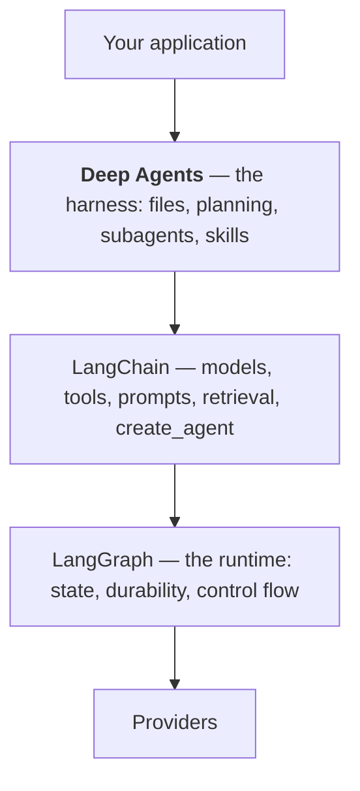

# Chapter 31 — Deep Agents, LangChain and LangGraph

Three libraries, one stack, and the question that decides your architecture: **which layer
should you be writing?**

## The stack



Chapter 5 proved the bottom of it: `create_deep_agent()` returns a LangGraph
`CompiledStateGraph`, with `model` and `tools` nodes and harness middleware attached. Measured
against a bare LangChain agent:

```
create_agent      nodes: ['__start__', 'model', '__end__']
create_deep_agent nodes: ['__start__', 'model', 'tools', 'PatchToolCallsMiddleware.before_agent', '__end__']
```

Same object, more middleware.

## Deep Agents and LangGraph are not a sequence

The most common misreading. LangChain → LangGraph is a progression: components, then the
runtime beneath them. Deep Agents is **not** the next step after LangGraph.

They are **alternatives at the same decision point**:

> **Deep Agents is a ready-made harness. LangGraph is control flow you design.**

Both sit on LangChain. Choosing between them is choosing whether the shape of your work is
*already the harness's shape*.

| Your work is | Use |
|---|---|
| Long, document-heavy, open-ended | **Deep Agents** — the harness fits |
| A specific graph: branch here, loop there, fan out | **LangGraph** — design it |
| A short loop with fixed tools | **LangChain** `create_agent` |
| Both — a harness inside a workflow | **compose them** |

## Which layer, by symptom

**Use LangChain** if your task finishes in a few turns and the steps are known. The harness's
~2,400 tokens per call buy nothing (Chapter 27).

**Use Deep Agents** if the work is long, the input is documents, and the context is the
problem. That is the specific ailment it cures.

**Use LangGraph** if you find yourself wanting:

- **A shape the harness does not have.** Branching on a condition, a bounded retry loop, fan-out
  over a runtime-determined number of items with merged results.
- **To remove the built-ins.** You cannot; they are always present (Chapter 14).
- **Different tool names or semantics.** Fixed.
- **Deterministic steps between model calls.** A harness turn is always a model call; a graph
  node need not be.
- **Precise pause points.** `interrupt_on` gates tools; `interrupt()` in a graph pauses
  anywhere you choose.

The signal in one line: **if you are fighting the harness's opinions, you want the layer that
has none.**

## Composing them

Not a rewrite, because a deep agent is a graph node:

```python
builder = StateGraph(State)
builder.add_node("triage", classify)                               # deterministic, no model
builder.add_node("investigate", create_deep_agent(model=model, tools=TOOLS))
builder.add_node("notify", send_summary)
builder.add_edge(START, "triage")
builder.add_conditional_edges("triage", route, ["investigate", "notify"])
```

Deterministic routing, a harness for the open-ended middle, deterministic follow-up. This is
usually the right production shape once a system is more than one agent: **the harness for the
part that genuinely needs it, a graph for the part you already understand.**

And the reverse composes too — a graph can be wrapped as a tool, and a deep agent can call it.

One caution from the companion book: `messages` uses a reducer, so nesting an agent in a graph
that also writes `messages` has a double-counting trap. Read its subgraph chapter first.

## Where to look when something breaks

The most useful habit in this book, restated:

| Mentions | Library |
|---|---|
| `InvalidUpdateError`, `GraphRecursionError`, checkpointer, thread, interrupt, superstep | **LangGraph** |
| tool schemas, `parse_docstring`, `response_format`, middleware, model construction | **LangChain** |
| backends, skills, subagents, `write_todos`, the filesystem tools | **Deep Agents** |

Deep Agents' documentation will not explain `GraphRecursionError`, because it is not theirs.
Two layers down is where the answer is.

## What you give up by going down a layer

Being fair to the harness:

Writing the graph yourself means writing — and then maintaining — planning, a virtual
filesystem, subagent spawning with context isolation, skills, and memory. That is the month
Chapter 1 mentioned. The harness is opinionated because opinions are what let it be
ready-made.

So the honest order is: **start at LangChain, move to Deep Agents when context becomes the
problem, and drop to LangGraph only for the parts whose shape you need to control.** Most
systems end up using all three, in different places.

## Try it

See all three layers in one object:

```bash
uv run python -c "
from deepagents import create_deep_agent
from langchain.agents import create_agent
from examples.scout.fakes import ScriptedModel
from langgraph.checkpoint.memory import InMemorySaver

deep = create_deep_agent(model=ScriptedModel(script=['ok']), checkpointer=InMemorySaver())
plain = create_agent(ScriptedModel(script=['ok']), tools=[])
print('deep  :', type(deep).__name__, list(deep.get_graph().nodes))
print('plain :', type(plain).__name__, list(plain.get_graph().nodes))
cfg = {'configurable': {'thread_id': 'x'}}
deep.invoke({'messages':[{'role':'user','content':'hi'}]}, cfg)
print('LangGraph state on a Deep Agent:', deep.get_state(cfg)._fields[:4])
"
```

A Deep Agents object, built with LangChain tools, exposing LangGraph state.

## Takeaways

- Three libraries, one stack. **`create_deep_agent()` returns a LangGraph
  `CompiledStateGraph`** — the same object `create_agent()` returns, with more middleware.
- **Deep Agents and LangGraph are alternatives, not a sequence.** A ready-made harness versus
  control flow you design.
- Use LangChain for short fixed loops; **Deep Agents when the task is long and context is the
  problem**; LangGraph when you need a shape the harness does not have.
- **If you are fighting the harness's opinions, you want the layer that has none.**
- They compose: a deep agent is a graph node. Deterministic routing outside, harness in the
  middle, is the usual production shape.
- **When something breaks, identify the owning library.** Deep Agents' docs will not explain
  `GraphRecursionError`.
- Going down a layer means writing and maintaining planning, a filesystem, subagents, skills
  and memory yourself. That is what the opinions buy you.

---

Previous: [Chapter 30 — Patterns](30-patterns.md) ·
Next: [Chapter 32 — Anti-patterns](32-anti-patterns.md)
